# Events Page
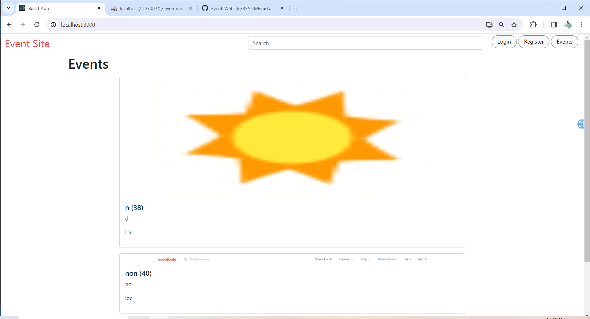

This is the Events Page.

# Registration Form
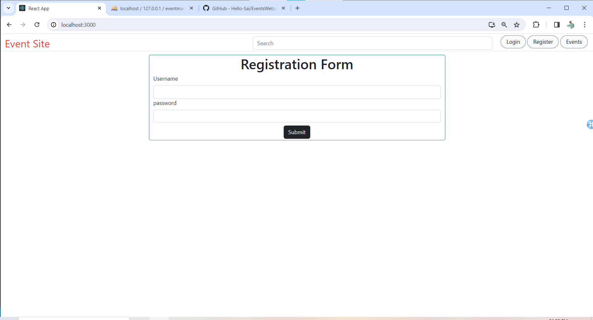

This is the Registration Form

# Restrict Duplicate Entries
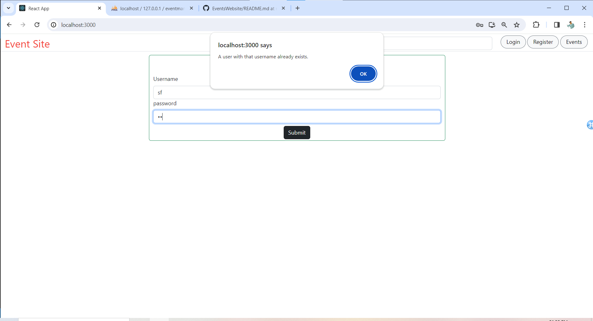

On Duplicate entries it shows errors

# Successful Registration message
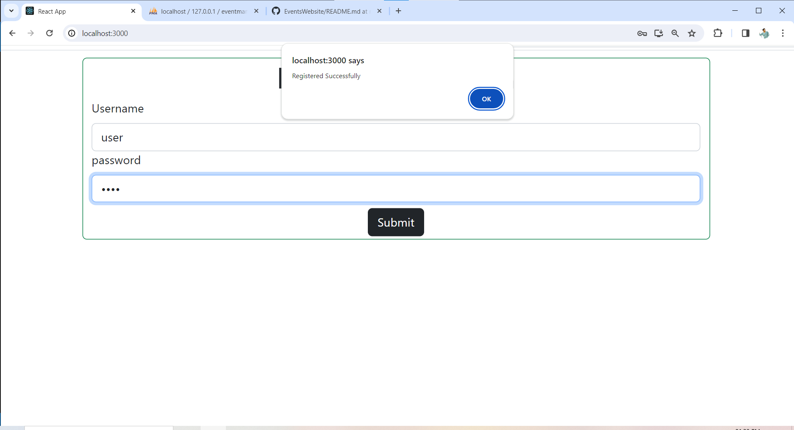

# Invalid Credentials for Login

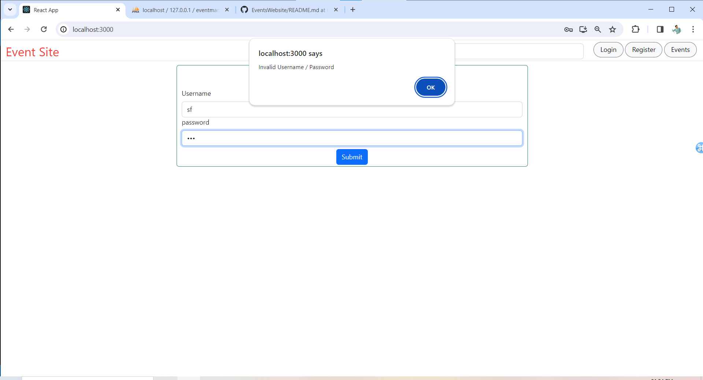

Alerts for Invalid Credentials

# Successful login redirects to events page

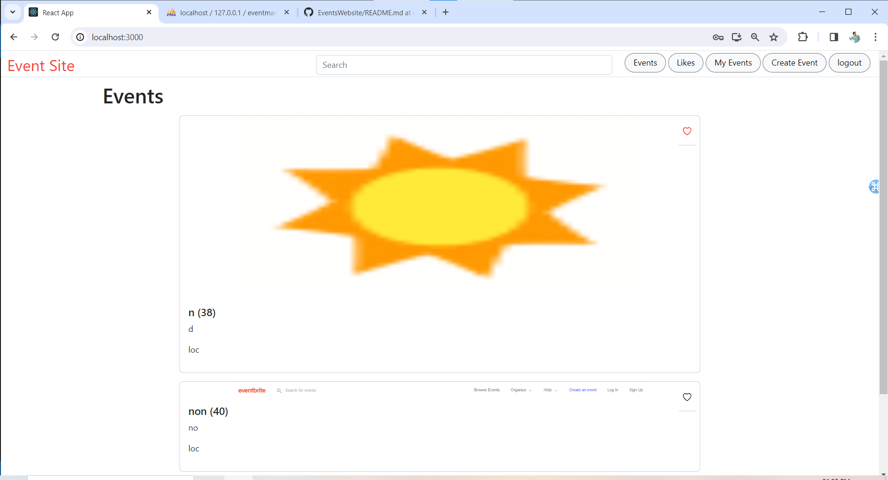

# like button 

# Liked Events
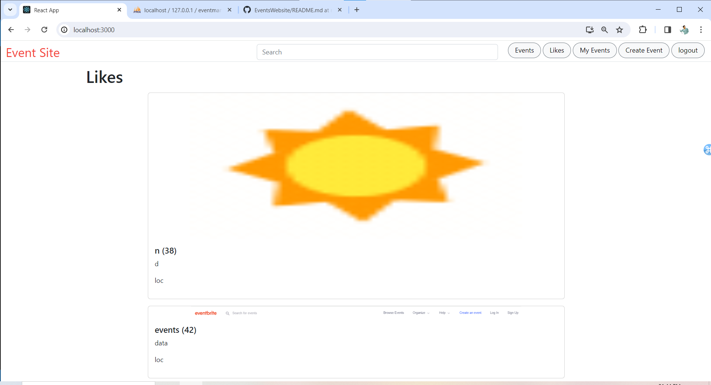

# User Specific Events

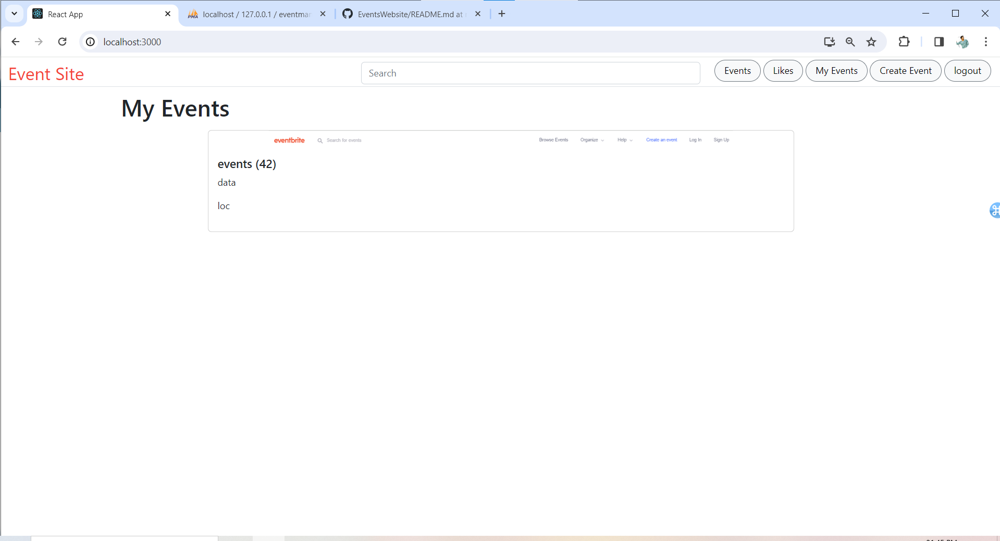

# Event Creation Form
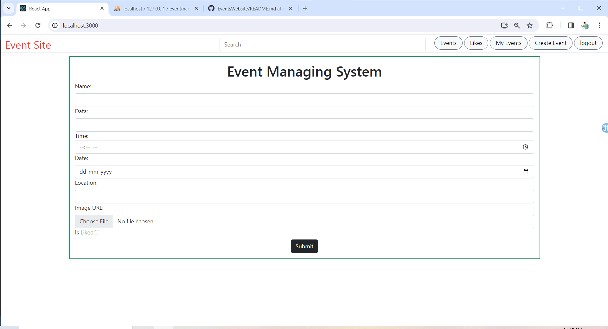

# Image Upload
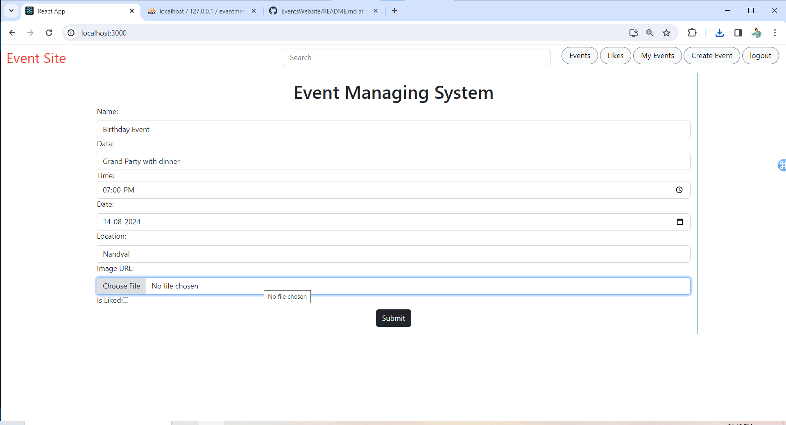

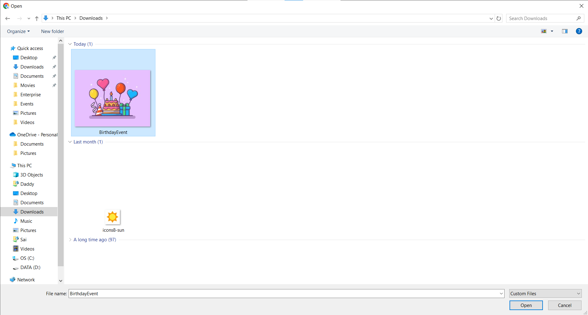

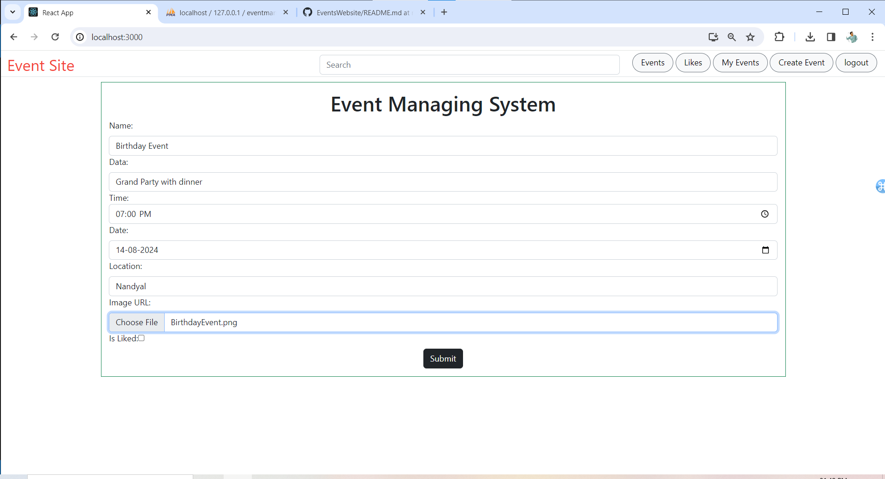

# After submission Updated in Events
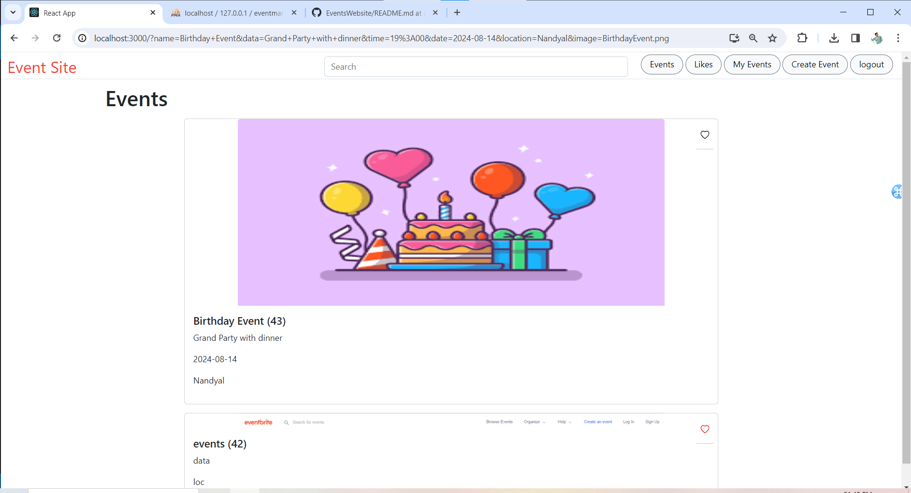

# Unliked Event

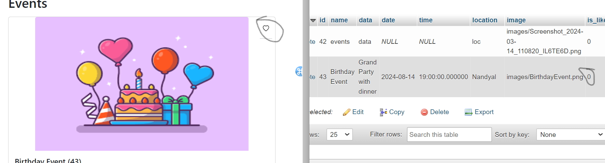

# Liked Event

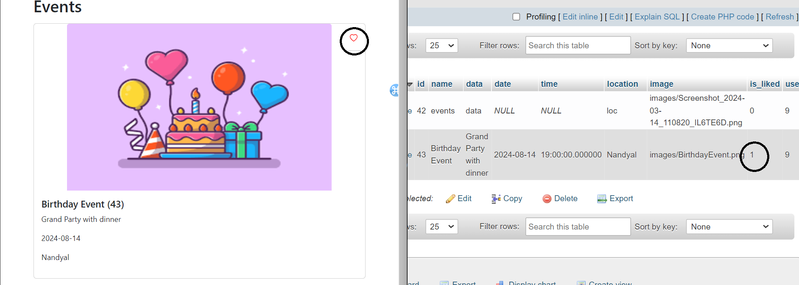
# Likes Page
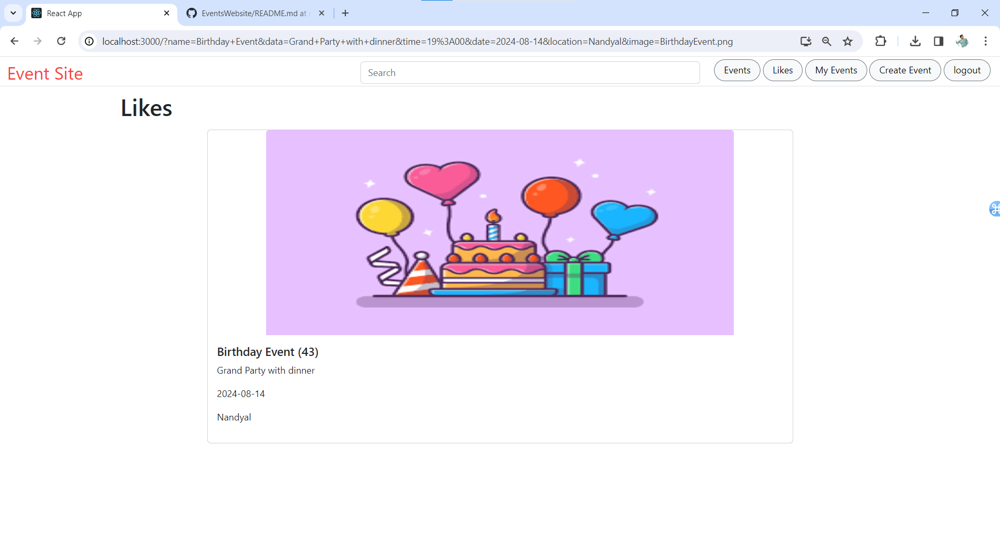
# click to logout
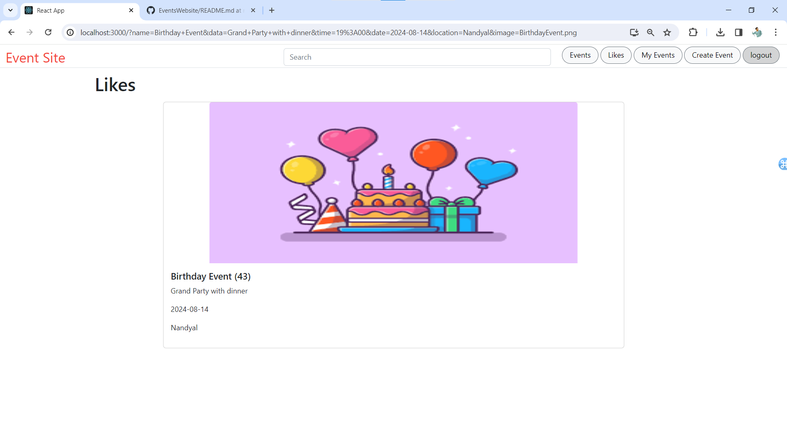

# Easily Filter Events by typing on Search 
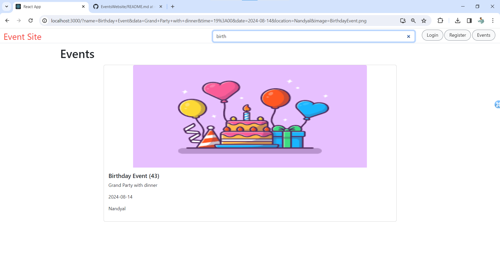