# This is My Web Page

# Registration Form

This is the Registration Form

# Restricts Duplicate Entries

On Duplicate entries it shows errors

# Successful Registration message
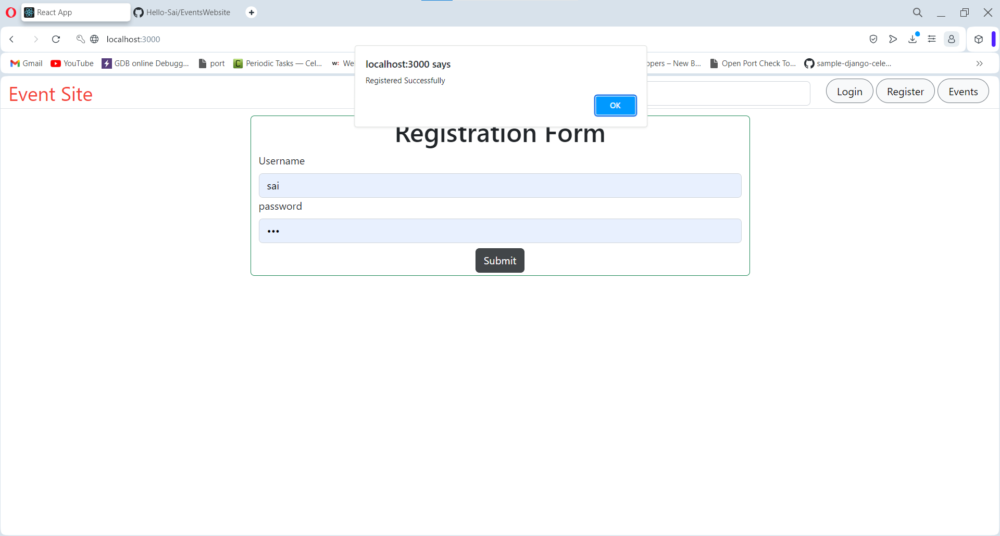

# Invalid Credentials for Login

Alerts for Invalid Credentials

# Successful login redirects to events page

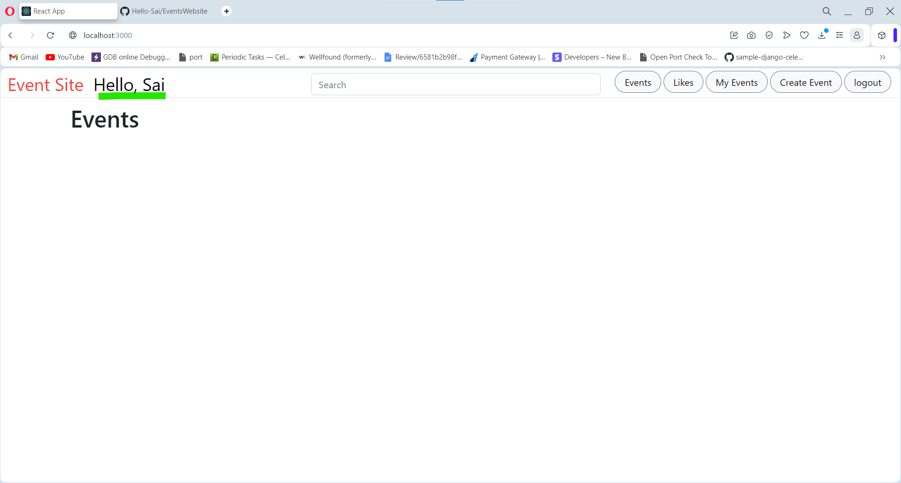

# Image Upload

# Event Creation Form
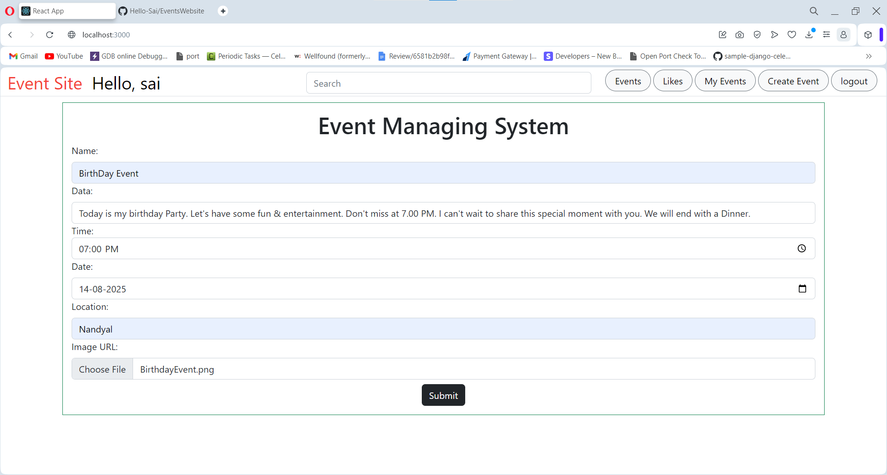

# Events can be shown lively
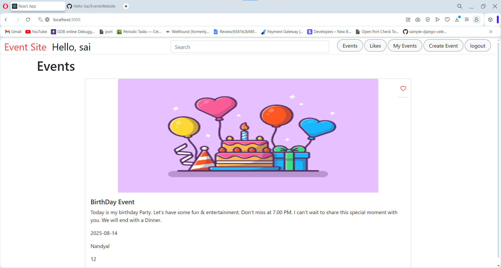

# like button 

# User Specific Events in My Events page
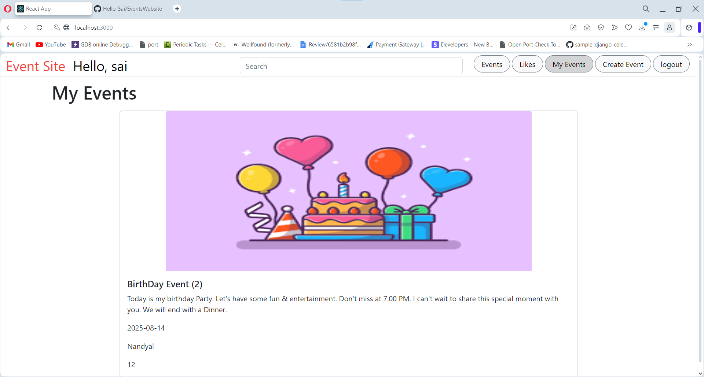

# Likes Page . Likes will be differed with users. Each user have their own liked events

# It won't effect other users

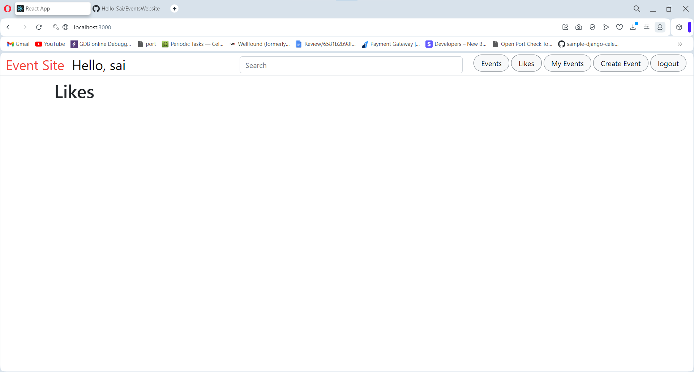
No Events liked

# logged out and login with another user kumar to like the event
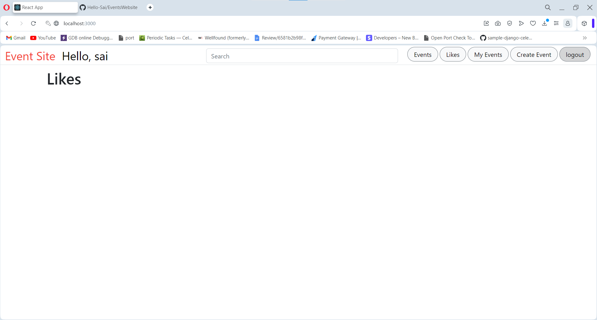
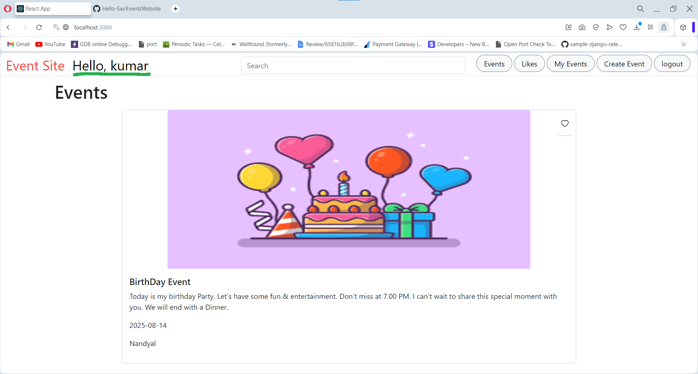

# No likes 
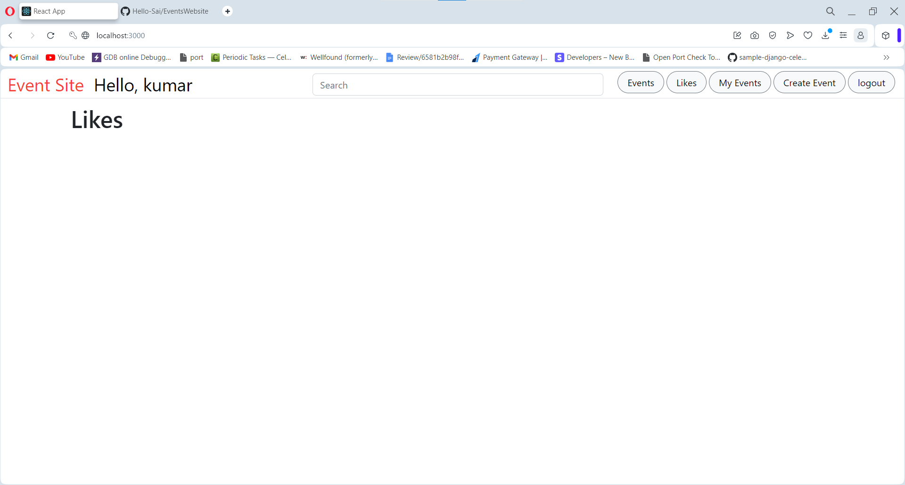

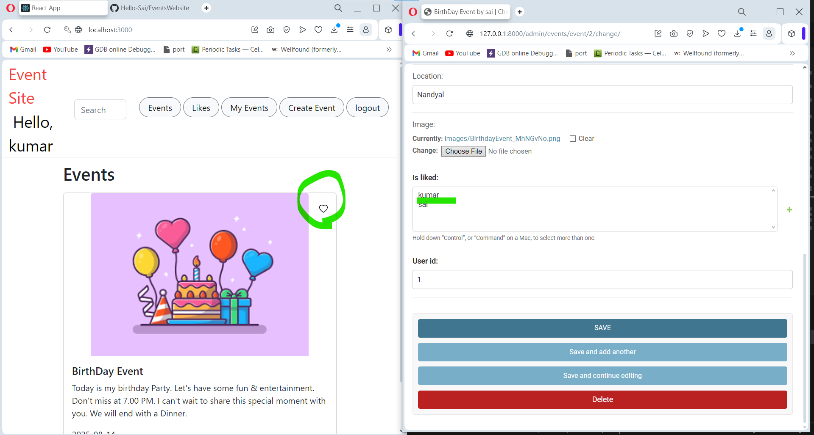

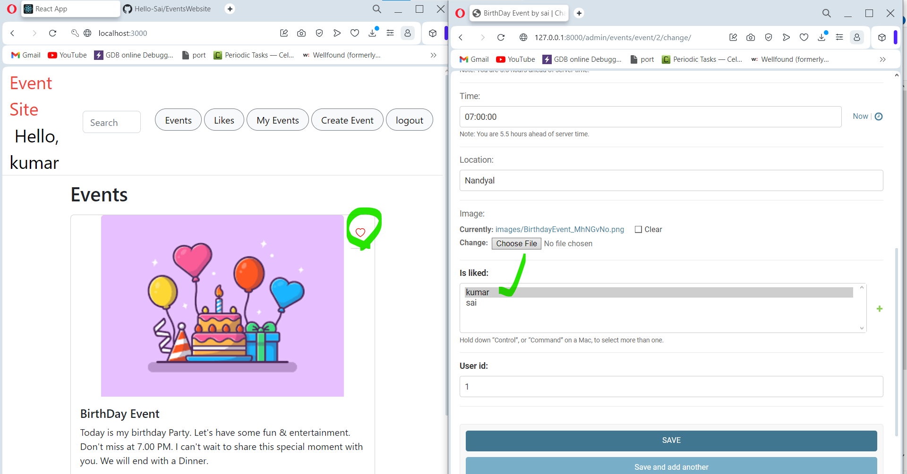

# created 2 more events Costume Party and Normal Party Events.
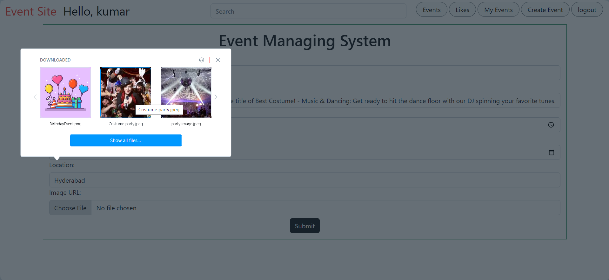

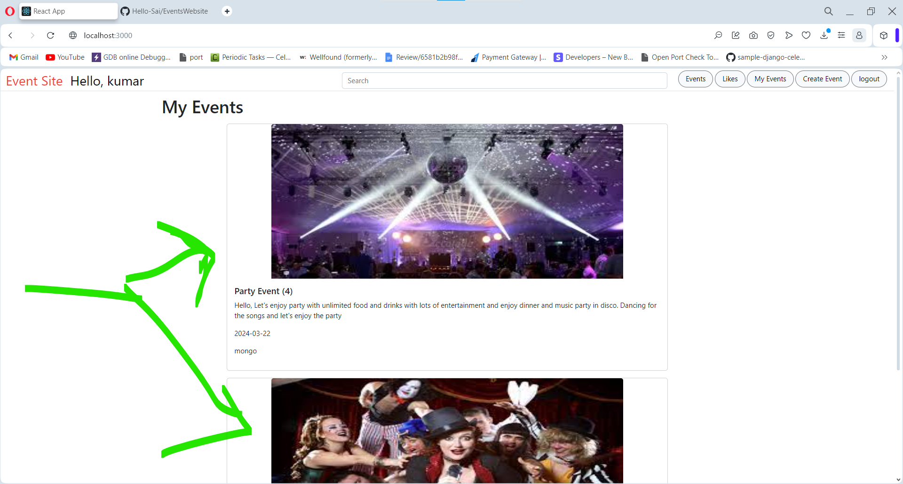
# Here is the Database

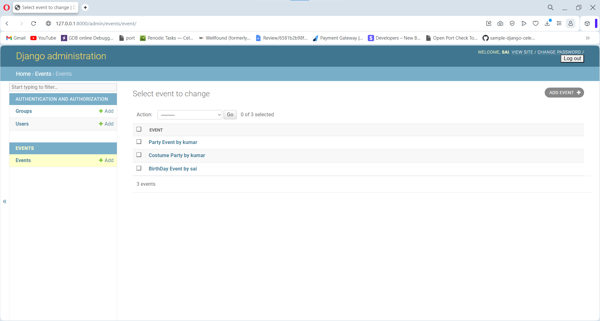
# No likes
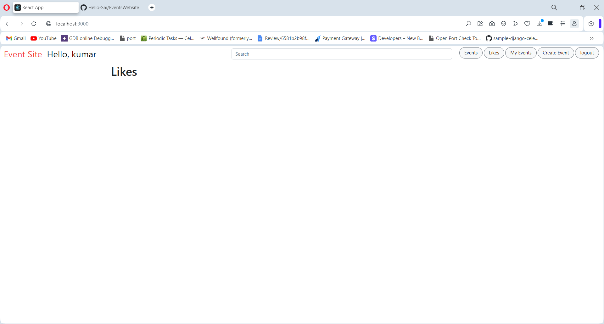

# After hitting like heart becomes red in color
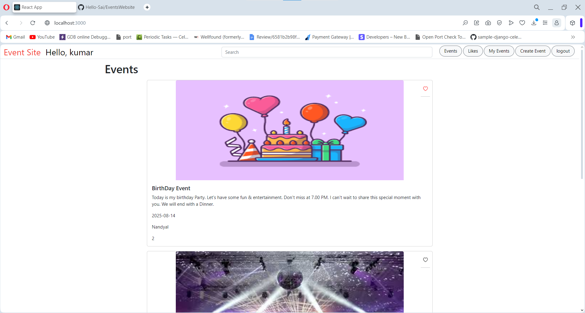
# We Can observe in likes page
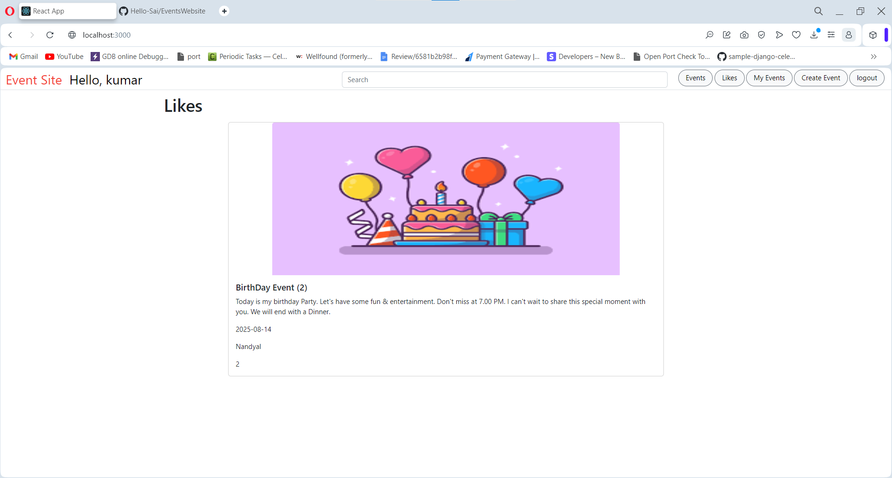

# Easily Filter Events by typing on Search 

you can easily filter by name, location , data in the event.

# Thank You for giving this oppurtunity