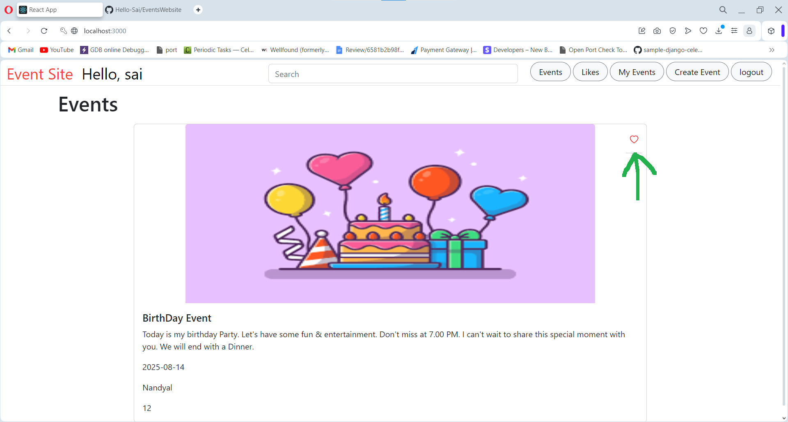

# Events Page

This is the Events Page.

# Registration Form

This is the Registration Form

# Restrict Duplicate Entries

On Duplicate entries it shows errors

# Successful Registration message

# Invalid Credentials for Login

Alerts for Invalid Credentials

# Successful login redirects to events page

# like button 

# Liked Events

# User Specific Events

# Event Creation Form

# Image Upload

# After submission Updated in Events

# Unliked Event

# Liked Event

# Likes Page

# click to logout

# Easily Filter Events by typing on Search 
